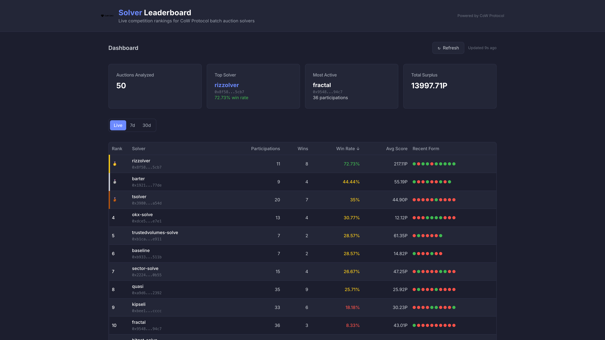

# CoW Solver Leaderboard

   

A live leaderboard tracking solver competition results on [CoW Protocol](https://cow.fi). CoW Protocol is a DEX aggregation protocol where third-party solvers compete every few seconds to find the best execution path for batches of user trade intents. Winners settle the batch on-chain and earn COW token rewards.

This dashboard ranks solvers by win rate, participation count, and score — with both real-time and historical views.



## Features

- **Live view** — aggregates the latest batch auctions from the CoW Protocol API in real-time
- **7d / 30d historical views** — weekly solver performance powered by [Dune Analytics](https://dune.com)
- Sortable leaderboard table with win rate, participations, and recent form indicators
- Trend arrows showing win rate changes vs previous period
- Detailed solver drawer with performance charts (per-auction bar chart or weekly line chart)
- Dark theme with responsive mobile layout
- Server-side data fetching with caching (60s for live, 1h for Dune)

## Getting Started

```bash
npm install
npm run dev
```

Open [http://localhost:3000](http://localhost:3000) to view the leaderboard.

The **live view** works out of the box — no API keys needed.

### Enabling historical views (optional)

To enable 7d/30d views, you need a [Dune Analytics](https://dune.com) account (free tier works):

1. Create a new query on Dune with the following SQL:

```sql
SELECT
  date_trunc('week', b.block_date) AS week,
  s.name AS solver_name,
  CAST(b.solver_address AS VARCHAR) AS solver_address,
  COUNT(*) AS batches_solved,
  SUM(b.num_trades) AS total_trades,
  SUM(b.dex_swaps) AS total_dex_swaps,
  SUM(b.batch_value) AS total_batch_value,
  SUM(b.gas_used) AS total_gas_used
FROM cow_protocol_ethereum.batches b
LEFT JOIN cow_protocol_ethereum.solvers s
  ON b.solver_address = s.address
WHERE b.block_date >= NOW() - INTERVAL '90' DAY
GROUP BY 1, 2, 3
ORDER BY 1 DESC, 4 DESC
```

2. Save the query and copy the query ID from the URL
3. Create a `.env.local` file:

```
DUNE_API_KEY=your_dune_api_key
DUNE_QUERY_ID=your_query_id
```

## Data Sources

### CoW Protocol API (live view)

Public API, no key required. Rate limit: 100 req/min.

- [`GET /solver_competition/latest`](https://api.cow.fi/mainnet/api/v1/solver_competition/latest) — most recent batch auction
- [`GET /solver_competition/{auctionId}`](https://docs.cow.fi/cow-protocol/reference/apis/orderbook) — specific auction by ID

### Dune Analytics (7d / 30d views)

Uses the [Dune API](https://docs.dune.com/api-reference/overview) to query `cow_protocol_ethereum.batches` — the same Spellbook tables used by [CoW Protocol's official dashboards](https://dune.com/cowprotocol/cow-solver-rewards).

## Tech Stack

- **Framework**: Next.js 14 (App Router, server components)
- **Language**: TypeScript
- **Styling**: Tailwind CSS + shadcn/ui
- **Charts**: Recharts
- **Data**: CoW Protocol API + Dune Analytics
- **Deployment**: Vercel
